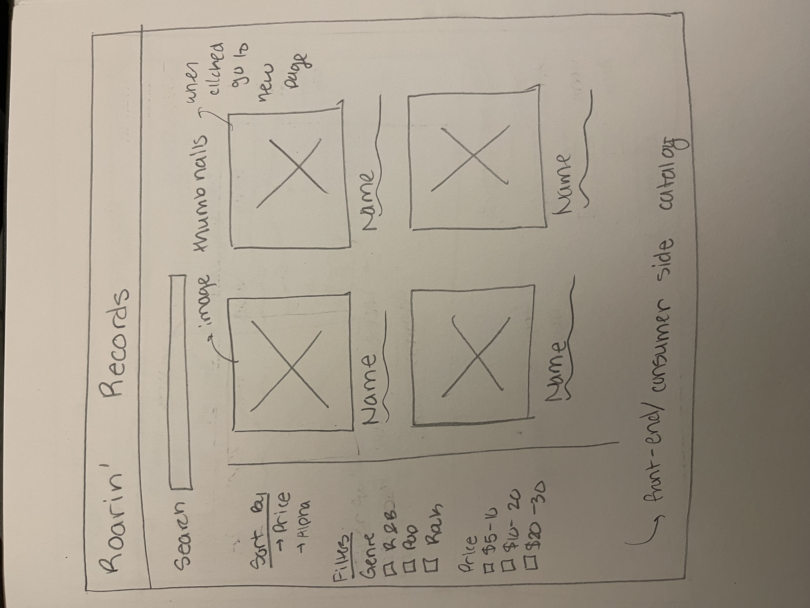
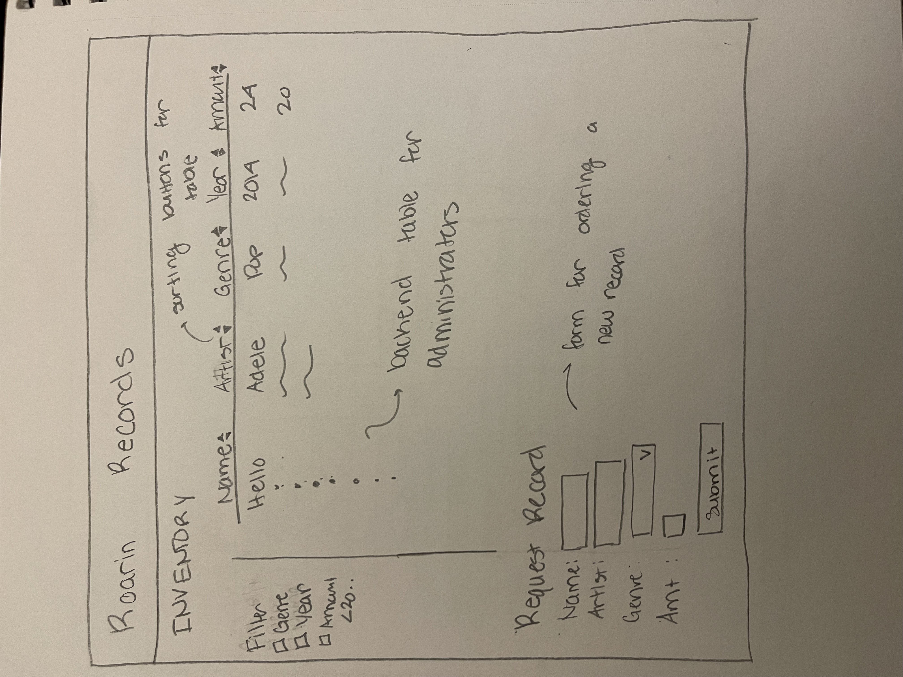
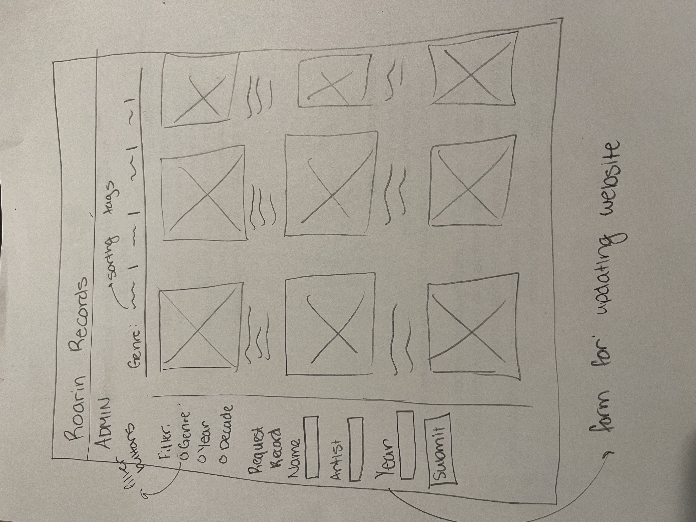
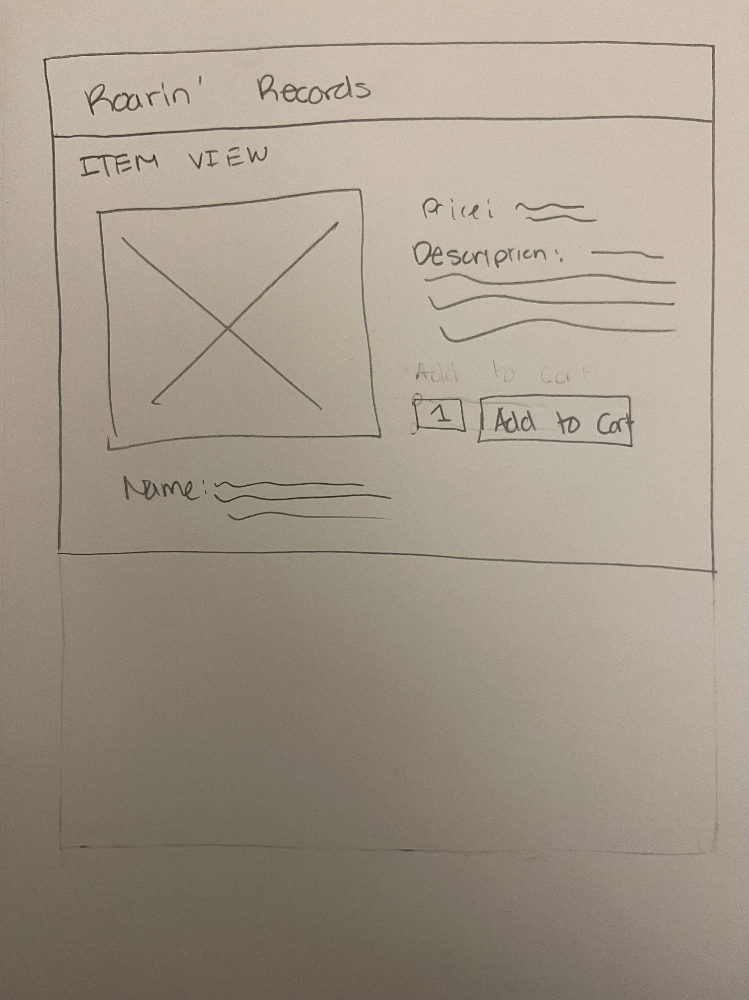
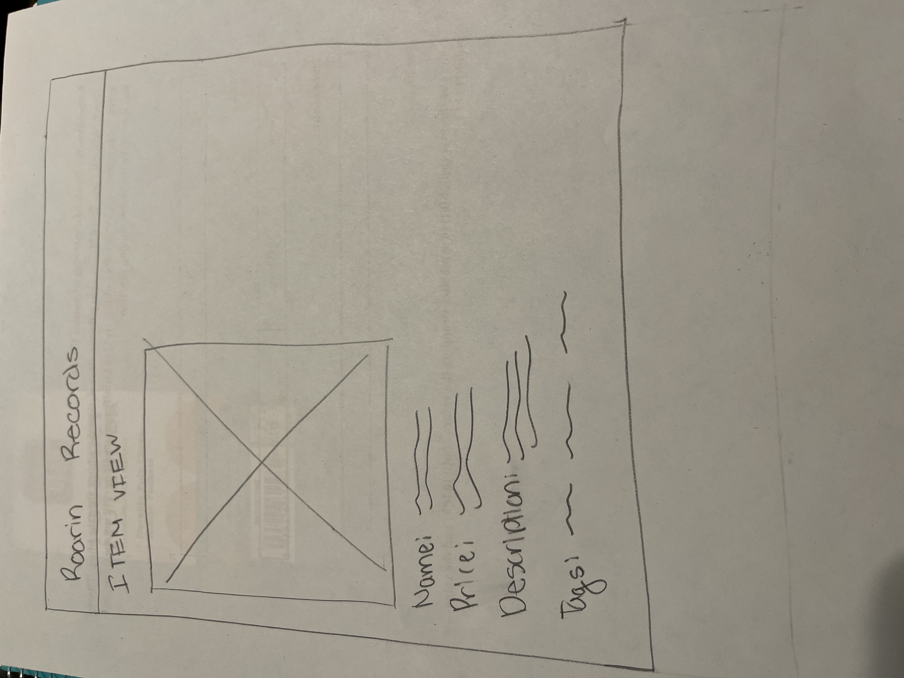

# Project 3: Design Journey

**For each milestone, complete only the sections that are labeled with that milestone.** Refine all sections before the final submission.

You are graded on your design process. If you later need to update your plan, **do not delete the original plan, rather leave it in place and append your new plan _below_ the original.** Then explain why you are changing your plan. Any time you update your plan, you're documenting your design process!

**Replace ALL _TODOs_ with your work.** (There should be no TODOs in the final submission.)

Be clear and concise in your writing. Bullets points are encouraged.

**Everything, including images, must be visible in _Markdown: Open Preview_.** If it's not visible in the Markdown preview, then we can't grade it. We also can't give you partial credit either. **Please make sure your design journey should is easy to read for the grader;** in Markdown preview the question _and_ answer should have a blank line between them.


## Design Plan (Milestone 1)

**Make the case for your decisions using concepts from class, as well as other design principles, theories, examples, and cases from outside of class (includes the design prerequisite for this course).**

You can use bullet points and lists, or full paragraphs, or a combo, whichever is appropriate. The writing should be solid draft quality.


### Catalog (Milestone 1)
> What will your catalog website be about? (1 sentence)

Catalog Brainstorm Ideas

- Trading cards: Pokemon
- Ice skates/skating attire
- Shopping/clothing website
- Vintage record website
- R&B Catalog
  - Vinyl record Shop
- Crochet Clothing store catalog
- Childhood video games
- Mario Cart Top Characters/Cars
- Magazine Catalog
  - Images that lead to each story

- Blog Catalog
  - Posts that are posted that link to the story associated with it


**Catalog Topic**: Online Vinyl Record Shop


### _Consumer_ Audience (Milestone 1)
> Briefly explain your site's _consumer_ audience. Your audience should be specific, but not arbitrarily specific. (1 sentence)
> Justify why this audience is a **cohesive** group. (1-2 sentences)
>


Site audience: People interested in Vinyl records for decor, to listen to and to gift to people who collect Vinyl Records

Why is this a _cohesive_ audience?

This is a cohesive audience because it's not too broad where it includes everyone on the web, but narrows down a specific set of people who are interested in the niche of vinyl records. People coming to this website are able to look for a specific type of record to their liking without being too narrow.


### _Consumer_ Audience Goals (Milestone 1)
> Document your _consumer_ audience's goals for using this catalog website.
> List each goal below. There is no specific number of goals required for this, but you need enough to do the job (Hint: It's more than 1. But probably not more than 3.)
> **Hint:** Users will be able to view all entries in the catalog and insert new entries into the catalog. The audience's goals should probably relate to these activities.

Goal 1: Easily search/look for a record that fits your personal music tatst

- **Design Ideas and Choices** _How will you meet those goals in your design?_
  - Have a search function within the catalog and filters based on genre, artists, year, awards etc.
  - Have images/icons that show how things are sorted (up vs. down arrows)
- **Rationale & Additional Notes** _Justify your decisions; additional notes._
  - Having the ability to search and filter allows for people to narrow down a large amount of information into something that's easier to digest

Goal 2: Use an intuitive and aesthetically pleasing user interface

- **Design Ideas and Choices** _How will you meet those goals in your design?_
  - Use consistent design patterns throughout my website, with backgrounds that enhance the product and easy to read text and headings.
- **Rationale & Additional Notes** _Justify your decisions; additional notes._
  - It's important for users to like the site that they're on so they spend more time interacting with your website and enjoy the time they're spending finding what they want.

Goal 3:  Have a customizable experience on the website

- Design ideas
  - Having a sign in option and letting people save their favorite records or add to a shopping cart to fulfill an order.
- Rationale
  - Customization is really important in helping users find what they're looking for, but also save time if they're recurring members to the website. Having this ability helps them to even better tailor the experience of looking for a record.


### _Consumer_ Audience Device (Milestone 1)
> How will your _consumer_ audience access this website? From a narrow (phone) or wide (laptop) device?
> Justify your decision. (1 sentence)

Audience device: Website

Device Justification:

- Many people when they're doing online shopping typically do it from their computer and the comfort of their home where they're able to envision the things that their buying. Catalogs often contain a lot of information as well, and it's easier to scan/look for things when they're displayed on a larger screen.


### _Consumer_ Persona (Milestone 1)
> Use the goals you identified above to develop a persona of your site's _consumer_ audience.
> Your persona must have a name and a face. The face can be a photo of a face or a drawing, etc.


<!--Source: https://www.vecteezy.com/png/9398917-woman-face-expression-clipart-design-illustration -->


Persona name: Ally

**Factors that Influence Behavior:**

Summary of the persona's factors that influence their behavior (1-2 bullet points)

- Price of Record
- Artist
- Genre of record
- Era of music


**_Revised_**

- Price of record
- Artist
- Genre of record


**Goals:**
Summary of persona's goals (1-2 bullet points)

- Ally wants to order records for her music wall at home and also has friends that love vinyl records so she also wants to be able to easiy find records to gift to them.

**Obstacles:**

Summary of persona's obstacles (1-2 bullet points)

- It can be hard to find reasonably priced records/the exact record from specific artists that she likes. ALly is still in college and is working but doesn't have super expendable disposable income.


**Desires:**

Summary of persona's desires (1-2 bullet points)

- Ally desires to have an aesthetically pleasing record wall customized with her favorite records from her favorite artists.
- She also desires to use an easily navigable storefront website to find her favorites fast.


### _Administrator_ Audience (Milestone 1)
> Briefly explain your site's _administrator_ audience. Your audience should be specific, but not arbitrarily specific. (1 sentence)
> Justify why this audience is a **cohesive** group. (1-2 sentences)

Site audience:

- Managers/Administrators who help with the shipping, organization and maintenance of the vinyl record shop.
Update when new record shipments ar

Why is this a _cohesive_ audience?

This is a cohesive audience because it contains


### _Administrator_ Audience Goals (Milestone 1)
> Document your _administrator_ audience's goals for using this catalog website.
> List each goal below. There is no specific number of goals required for this, but you need enough to do the job (Hint: It's more than 1. But probably not more than 3.)
> **Hint:** Users will be able to view all entries in the catalog and insert new entries into the catalog. The audience's goals should probably relate to these activities.

Goal 1: Update record table data

**_Revised_**
Goal 1: Update/Add records to the website

- **Design Ideas and Choices** _How will you meet those goals in your design?_
  - Design ideas (1-2 sentences)
  - Include a form within the website that updates the table automatically
- **Rationale & Additional Notes** _Justify your decisions; additional notes._
  - Rationale  (1-2 sentences)
  - Forms are user friendly and an easy way to gain information from the user. Forms also allow personalized information to be filtered through backend webprogramming so that it is correctly entered into any table.

Goal 2: Organize data to be easily interpret

- **Design Ideas and Choices** _How will you meet those goals in your design?_
  - Design ideas (1-2 sentences)
  - Include sorting, filtering and searching to be used within within the table

**_Revised_**

- Include filtering the be used within the table


- **Rationale & Additional Notes** _Justify your decisions; additional notes._
  - Rationale (1-2 sentences)
  - Sorting and filtering are common design practices that are used within catalogs and help the user narrow down and organize data so they can use it efficiently.

**_Rationale Revised:_**

- Sorting and searching can be a little complicated but being able to filter the site based off of the tags present for each item provides the best way for organization and easy interpretation. Bolding the tag/using checkboxes to show the user what they're sorting by is another great design patternt to help with organization

Goal 3: Have a personalized interface for my specific type of user

- Design ideas
  - Include a login/logout place so that the website is designed to best fit the administrator using it. the administrator is able to see certain functions and information that consumers shouldn't be able to see.

- Rationale
  - To have a well-designed website it's important to tailor the site to the user to best fit their needs. Consumers and administrators have different goals so having a place to login/logout to change the site layout to best fit their needs is important.


### _Administrator_ Persona (Milestone 1)
> Use the goals you identified above to develop a persona of your site's _administrator_ audience.
> Your persona must have a name and a face. The face can be a photo of a face or a drawing, etc.

<!-- https://www.pngitem.com/middle/biowhm_clip-art-business-man-clipart-man-and-woman/ -->


Persona Name: Sam

**Factors that Influence Behavior:**

Summary of the persona's factors that influence their behavior (1-2 bullet points)

- Sam is a manager for the record shop is in charge of managing shipments/new orders of records
- He's influenced by how many shipments are coming in, or if a record is marked low inventory so that he can order more.

**_Revised_**

- Same is also influenced by new albums/shipments that have arrived

**Goals:**

Summary of persona's goals (1-2 bullet points)

- Update the inventory and new shipments when it comes in
- Submit a request for new items if things are running low within the shop.

**_Revised_**

- Add new albums to the storefront to keep up with customer demand
- Update the website to reflect any new albums that the store has received to update customers.

**Obstacles:**

Summary of persona's obstacles (1-2 bullet points)

- Currently Sam can't see in real time the current levels of inventory of each item.
- There are many levels to inventory and sometimes it's unorganized and confusing to use.
- He isn't very tech savvy so he doesn't know how to organize it effectively.

**Desires:**

Summary of persona's desires (1-2 bullet points)

- Use a personalized website interface suited for administrators that makes it easy for him to find information and maintain the store
- Do well at his job so customers have a working website and can find the cool records they need.


### Catalog Data (Milestone 1)
> Using your personas, identify the data you need to include in the catalog for your site's audiences.
> Justify why this data aligns with your persona's goals. (1 sentence)

Data persona will need to effectively use the catalog

- Record Album Name
- Record Genre
- Artist
- Price
- Description
- Year Made
- Record Rating
- Record Image
- Inventory Amount
- (Revised: Shopping Cart, Inventory Amount Removed)

Justification: why does this data aid the persona with their goals?

- These pieces of data help both Ally and Sam use the website to find specific information about any records they're inquiring about. Having these different data points allows both of them to to sort and filter content in a way that best helps them so that they can find what they're looking for.


### Site Design (Milestone 1)
> Design your catalog website to address the goals of your personas.
> Sketch your site's design:
>
> - These are **design** sketches, not _planning_ sketches.
> - Use text in the sketches to help us understand your design.
> - Where the content of the text is unimportant, you may use squiggly lines for text.
> - **Do not label HTML elements or annotate CSS classes.** This is not a planning sketch.
>
> Provide a brief explanation _underneath_ each sketch. (1 sentence)
> **Refer to your persona by name in each explanation.**




- Sketch of the catalog for Abby (consumer side)




- Sketch of the catalog for Sam (administrator side)

**_Revised Sketch Explanation_**

- In the revised sketch I made the admin page look a lot more like the consumer page just for consistency between designs. Sam's main goal is to now update the page to reflect any new information he sees on the administrator side of things.




- Sketch of the page to view the image if wanting to buy.

**_Revised Sketch Explanation_**

- In the revised sketch of the details page I tried another sketch with a different (vertical) orientation for a better flow of the page.


### Catalog Design Patterns (Milestone 1)
> Explain how you used design patterns in your site's design. (1-2 sentences)

Design pattern explanation

- My site's design includes a sidebar for filtering and sorting along with a search bar at the top of the page consistent with most design patterns making it intuitive for Abby to use when looking for records. For Sam, my table includes upper and lower arrow images to show the sorting of the rows in the table to help him sort information more easily.

## Implementation Plan (Milestone 1, Milestone 2, Milestone 3, Final Submission)

### Database Schema (Milestone 1)
> Plan the structure of your database. You may use words or a picture.
> A bulleted list is probably the simplest way to do this.
> Make sure you include constraints for each field.


Table: products

- id: INTEGER {PK, U, NN, AI}
- album_name: TEXT {NN}
- records_id: TEXT {NN} FK -> records.artist
- image: INTEGER{NN}
- descrip: TEXT {NN}
- amount: INTEGER {NN}
- genre_id: INTEGER {NN} FK -> genres.id

Table: records

- id: INTEGER {PK, U, NN, AI}
- artist: TEXT {NN}
- rating: INTEGER {NN}
- price: FLOAT {}
- year: INTEGER {NN}

Table: genres

- id: INTEGER {PK, U, NN, AI}
- type: TEXT {NN}


**_Revised Database Schemas_**

Table: Records

- id: INTEGER {PK, U, NN, AI}
- album_name: TEXT {NN}
- album_year: INTEGER {NN}
- artist: TEXT {NN}
- price: FLOAT {NN}

Table: Tags

- id: INTEGER {PK, U, NN, AI}
- genre: TEXT {NN}
- decade: INTEGER {NN}


Table: Records_Tags

- id: INTEGER {PK, U, NN, AI}
- records_id: TEXT {NN FK -> records.id}
- tags_id: INTEGER {NN FK -> tags.id}


### Database Query Plan (Milestone 1, Milestone 2, Milestone 3, Final Submission)
> Plan _all_ of your database queries.
> You may use natural language, pseudocode, or SQL.

```
SELECT products.name AS 'products.name',
       descrip.products AS 'descrip.products',
       records.artist AS 'records.artist',
       records.rating AS 'records.rating',
       records.price AS 'records.price',
    FROM products INNER JOIN records
      ON (products.records_id = records.id)

```


```
CREATE TABLE records (
  id: INTEGER {PK, U, NN, AI}
  album_name TEXT {NN}
  records_id TEXT {NN} FK -> records.artist
  image INTEGER{NN}
  descrip TEXT {NN}
  amount INTEGER {NN}
  genre_id INTEGER {NN}
)
  FOREIGN KEY(genres_id)
    REFERENCES genres(id)

  FOREIGN KEY(records_id)
    REFERENCES records(id)
```


```
CREAT TABLE genres(
  id: INTEGER {PK, U, NN, AI}
  type: TEXT {NN}
)
```


```
CREATE TABLE artists(
  id: INTEGER {PK, U, NN, AI}
  artist: TEXT {NN}
  rating: INTEGER {NN}
  price: FLOAT {}
  year: INTEGER {NN}
)
```


Insert Into Query draft

```
INSERT INTO table (field1, field2, field3...)
  VALUES(value1,value2,value3)
```


**Revised Query Plan**

--Records--

```
CREATE TABLE  records (
id INTEGER NOT NULL UNIQUE,
album_name TEXT NOT NULL,
album_year INTEGER NOT NULL,
artist TEXT NOT NULL,
price FLOAT NOT NULL,
PRIMARY KEY (id AUTOINCREMENT)
);
```


--Tags--

```
CREATE TABLE tags(
id INTEGER UNIQUE NOT NULL,
genre TEXT,
decade TEXT,
rating INTEGER,
 PRIMARY KEY (id AUTOINCREMENT)
);
```


--Records_Tags--

```
CREATE TABLE records_tags(
id INTEGER UNIQUE NOT NULL,
records_id INTEGER NOT NULL,
tags_id INTEGER,
 PRIMARY KEY (id AUTOINCREMENT)
FOREIGN KEY (records_id) REFERENCES records(id)
FOREIGN KEY (tags_id) REFERENCES tags(id)
);
```


--Users--

```
 CREATE TABLE users (
     id INTEGER NOT NULL UNIQUE,
     name TEXT NOT NULL,
     username TEXT NOT NULL UNIQUE,
     password TEXT NOT NULL,
    PRIMARY KEY (id AUTOINCREMENT)
 );
```


--Sessions--

```
 CREATE TABLE sessions (
     id INTEGER NOT NULL UNIQUE,
     user_id INTEGER NOT NULL,
     session    TEXT NOT NULL UNIQUE,
     last_login TEXT NOT NULL,
     PRIMARY KEY (id AUTOINCREMENT)
     FOREIGN KEY (user_id) REFERENCES users(id)
 );
```


## Complete & Polished Website (Final Submission)

### Accessibility Audit (Final Submission)
> Tell us what issues you discovered during your accessibility audit.
> What do you do to improve the accessibility of your site?

Audit fixes

- Fixed the font color in the heading. The black wasn't a good contrast against the dark maroon color so I changed the title in the header to be white.
- In the forms my labels weren't correctly associated with their inputs so I changed the ids to be equivalent for each record so things were grouped correctly.
- My images in the main page that showed all the records also did not have alternative text so I made sure that the alternative text for each image was the name followed by that Album Cover is supposed to be present.


### Self-Reflection (Final Submission)
> Reflect on what you learned during this assignment. How have you improved from Projects 1 and 2?

I learned a lot from this assignment. I think most importantly that big things are easier to handle if you break them down step by step and plan out what you want to do beforehand. Many of my coding classes have taught me this, but this project in particularly that if you can explain what you're trying to do in English/psuedocode and then work step by step in translating that into code that's the best way to do things. Since projects 1 and 2 I've gotten a lot better at implementing more complicated things and combining the things that I've learned. I feel more confident in using multiple databases and I have a better understanding of how each part of querying a database and gainining information on it works.


> Take some time here to reflect on how much you've learned since you started this class. It's often easy to ignore our own progress. Take a moment and think about your accomplishments in this class. Hopefully you'll recognize that you've accomplished a lot and that you should be very proud of those accomplishments! (1-3 sentences)

Seeing the final result of this project is really cool and so great to reflect on. Sometimes while working on the individual parts it doesn't feel very cool or special but seeing images, uploading, login/logout and filtering and forms all work so interactively on the same website is really cool. I feel like I've gained a lot of practical knowledge from doing this course and this project and feel confident in being able to replicate certain features to create different websites that I want to make.


### Collaborators (Final Submission)
> List any persons you collaborated with on this project.

Collaborator: Matt Wong (mcw243)

- Helped bounce ideas off of and troubleshoot code

### Reference Resources (Final Submission)
> Please cite any external resources you referenced in the creation of your project.
> (i.e. W3Schools, StackOverflow, Mozilla, etc.)


W3Schools,
Mozilla Reference Documentation,
StackOverflow

### Grading: User Accounts (Final Submission)
> The graders will need to log in to your website.
> Please provide the usernames and passwords.

**Administrator User:**

- Username: celestenaughton21
- Password: monkey

**Consumer User:**

- My website does not support consumer log in, just administrator log in.
**Note:** Not all websites will support consumer log in. If your website doesn't, say so.


### Grading: Step-by-Step Instructions (Final Submission)
> Write step-by-step instructions for the graders.
> The project if very hard to grade if we don't understand how your site works.
> For example, you must log in before you can delete.
> For each set of instructions, assume the grader is starting from /

_View all entries:_

1. Viewing all entries will be available automatically on the homepage
2. To view all entries after filtering by a tag, click the "All Records" link next to Show All Records above the Genre tags.
3. To view all entries after arriving on the details page, click on the "Roaring Records Home" link in the navigation bar in the header

_View all entries for a tag:_

1. For Genres: to view all entries for a tag, click on one of the links next to "Genre:" above all of the entries in the catalog.
2. For Ratings & Decades: select one of the tags to in the side bar. The form is by radio button so you're only allowed to choose one, then press the "Filter" Button to filter by the tag selected. After filtering, a title for the filter you've selected (i.e. Genre - Pop) will appear above the filtered selection

_View a single entry's details:_

1. To view a single entry's details, click on the thumbnail of the album provided.
2. If no Album is present due to technicalities, click on the hyperlink of the alt's text of the image. (Note: on the details page, some entries have descriptions (Spiderman: Into the SpiderVerse, Hello Dolly) and others do not (Thriller, Legend). All detail pages though show the appropriate tags and basic information about each album)

_How to insert and upload a new entry:_

1. To insert and upload a new entry 1st log in as an administrator. Only administrators have insert and upload access.
2. A form in the sidebar will appear once logged in. Fill in each field with the correct values: Album Name - text, Year Album Was Created - whole number (i.e. 2005), Enter Artist Name - text, Enter Album Price - float (i.e. - 20.99).
3. Then select a file to upload that is one of the files accepted by the form (jpg, png,)
4. Finally, click the "Upload New Record" button. The file will be inserted to the database, and the page will show the new album inserted into the table.

_How to delete an entry:_

1. My website does not support deleting an entry.
